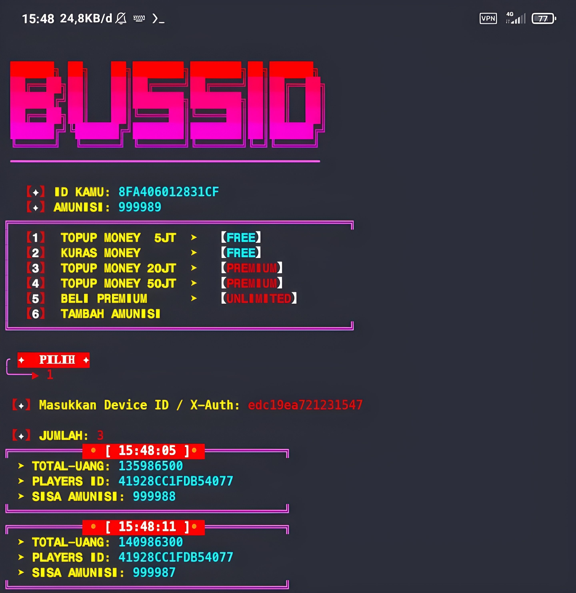

## SCRIPT


## Installation

```bash
apt update && apt upgrade -y
```

```bash
apt install git
```

```bash
apt install python
```

```bash
pip install requests
```

```bash
pip install aiohttp
```

```bash
git clone https://github.com/konchils404/bussid.git
```

```bash
cd bussid
```

```bash
python bussid.py
```


## GET TOKEN / DEVICE ID

• [Termux](https://f-droid.org/repo/com.termux_1000.apk)  (Jika Blm punya)

• [HTTP Canary Revolt](https://github.com/konchils404/bussid/releases/download/release/HttpCanary.apk) (Http Canary)

• [BUSSID 3.6.1](https://m.apkpure.com/id/bus-simulator-indonesia/com.maleo.bussimulatorid/download/3.6.1) ( wajib! hanya untuk mengambil token! ) 
> jika pake bussid versi terbaru, token / device id tidak muncul.

> Setelah topup selesai bisa langsung update bussid ke Versi Terbaru!


## Contact Me

• [whatsapp](https://wa.me/+6287878841498)

• [telegram](https://t.me/konchils)
